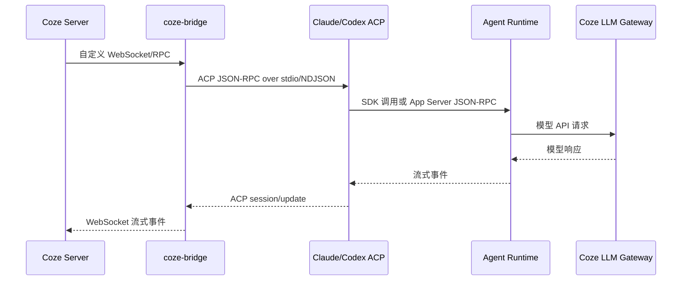

# Coze 本地 Agent 接入分析

> 记录日期：2026-07-25  
> 分析对象：Coze Bridge、Claude Agent ACP、Codex ACP  
> 证据范围：本机已安装的 Bridge/ACP 包及其运行配置；未获得 Coze 云端服务端源码。

## 1. 结论摘要

Coze 的本地 Agent 接入不是把当前终端窗口直接“搬到”Coze，而是：

1. Coze Bridge 在本机常驻运行，并与 Coze Server 建立长连接。
2. Coze Server 通过 Bridge 的自定义 RPC 下发会话、Prompt、权限和文件请求。
3. Bridge 为 Claude 或 Codex 启动独立的本地 Agent 子进程。
4. Bridge 与子进程之间使用 ACP 协议通信。
5. Agent Runtime 在本机执行文件、Shell 和工具操作。
6. Claude/Codex 的模型请求通过 Coze LLM Gateway 发往云端模型服务。

核心链路：

```text
Coze Server
  -- Coze 自定义 WebSocket/RPC -->
coze-bridge
  -- ACP JSON-RPC / NDJSON over stdio -->
claude-agent-acp / codex-acp
  -- Claude SDK 或 Codex App Server 协议 -->
Claude Code / Codex Runtime
  -- Anthropic/OpenAI-compatible HTTP -->
Coze LLM Gateway
```

ACP 只负责 Agent 的控制协议，不负责模型 API 本身。

## 2. 最初安装命令做了什么

```bash
npx -y --registry=https://registry.npmmirror.com \
  coze-bridge@latest \
  --pat-token=<PAT> \
  --pair-code=<PAIR_CODE>
```

这条命令的主要作用是：

- 临时下载并运行 `coze-bridge`。
- 使用指定 registry 获取 npm 包。
- 使用 PAT 和一次性 Pair Code 完成本机与 Coze Agent 的配对。
- 安装或确认 Claude/Codex 对应的 ACP 适配器。
- 在 macOS 上注册 LaunchAgent，使 Bridge 开机自启、异常后保持运行。
- 保存 Bridge 配置、Token、端口和日志。

本机安装后的核心位置包括：

```text
~/.coze/bridge/bin/coze-bridge
~/.coze/bridge/lib/index.js
~/.coze/bridge/lib/node_modules/@agentclientprotocol/claude-agent-acp
~/.coze/bridge/lib/node_modules/@agentclientprotocol/codex-acp
~/Library/LaunchAgents/ai.coze.bridge.plist
~/.coze/bridge/logs/
```

本机安装版本曾观察到：

```text
claude-agent-acp 0.44.0
codex-acp         1.1.7
```

具体版本可能随 `@latest` 更新而变化。

## 3. 协议分层



### 3.1 Coze Server 到 Bridge

这一层不是标准 ACP，而是 Coze Bridge 自己的控制协议。

从本机日志和 Bridge 代码可以确认：

- Bridge 会连接 Coze Frontier WebSocket。
- 观察到的地址为 `wss://frontier.coze.cn`。
- 配对阶段会访问 Coze HTTP 服务。
- Bridge 会发送配对请求和周期性 heartbeat。
- Bridge 内部注册了 `_agent/create`、`_agent/health`、`_agent/getFileTree`、`_agent/getFileContent`、`_agent/switchModel` 等扩展接口。
- Bridge 会调用 `_agent/genModelToken` 为云端会话获取模型访问 Token。

逻辑上，云端会下发或触发以下操作：

```text
session/new
session/load
session/prompt
session/cancel
session/request_permission
```

这些方法名可能与 ACP 对齐，但它们在 Bridge 外层的承载方式仍是 Coze 自定义 WebSocket/RPC，而不是 Coze Server 直接把 ACP 字节流透传给本地 Agent。

### 3.2 Bridge 到 ACP

Bridge 会启动独立的 ACP 子进程：

```text
claude-agent-acp
codex-acp
```

双方通过 stdin/stdout 通信。当前安装版本中，消息是 JSON-RPC 风格的 NDJSON，即一行一个 JSON 消息。

概念示例：

```json
{"jsonrpc":"2.0","id":1,"method":"initialize","params":{}}
```

```json
{"jsonrpc":"2.0","id":2,"method":"session/new","params":{"cwd":"/tmp/project"}}
```

```json
{"jsonrpc":"2.0","id":3,"method":"session/prompt","params":{"sessionId":"session-123","prompt":[{"type":"text","text":"检查这个项目"}]}}
```

ACP Agent 回传的流式事件通常通过 `session/update` 表达，例如文本片段、工具调用、思考片段、用量信息和状态变化。

Bridge 在这里扮演 ACP Client，Claude/Codex ACP 适配器扮演 ACP Agent。

## 4. Claude Agent ACP

相关本地代码：

- [Claude ACP 入口](file:///Users/yuange.zjy/.coze/bridge/lib/node_modules/@agentclientprotocol/claude-agent-acp/dist/index.js)
- [Claude ACP 核心实现](file:///Users/yuange.zjy/.coze/bridge/lib/node_modules/@agentclientprotocol/claude-agent-acp/dist/acp-agent.js)

### 4.1 进程结构

Claude 的实际链路是：

```text
coze-bridge
  └── claude-agent-acp
        └── Claude Agent SDK query()
              └── Claude Code Runtime
```

这里不是简单地执行：

```bash
claude -p "..."
```

而是 Claude ACP 通过 `@anthropic-ai/claude-agent-sdk` 的 `query()` 管理 Agent 会话。SDK 会解析并使用 Claude Code 的底层可执行文件路径，运行 Claude Code Runtime。

Claude ACP 入口还支持 `--cli` 模式，把参数直接转给 Claude CLI；但 Coze Bridge 默认使用的是 ACP 模式，而不是这个直通模式。

### 4.2 `session/new` 和 `session/prompt`

创建会话时，Claude ACP 会准备：

- 当前工作目录 `cwd`。
- 权限模式 `permissionMode`。
- MCP Server 配置。
- 是否允许跳过权限检查。
- Claude Code 可执行文件路径。
- 附加目录。
- `canUseTool` 权限回调。
- 流式消息开关 `includePartialMessages`。

随后调用：

```js
query({ prompt, options })
```

Prompt 和 SDK 产生的事件会被转换成 ACP 的 `session/update`。

### 4.3 Claude 模型请求路由

Bridge 会为会话获取 `modelToken`，并向 Claude Runtime 注入类似环境变量：

```text
ANTHROPIC_BASE_URL=https://llm-gateway.coze.cn
ANTHROPIC_AUTH_TOKEN=<session-model-token>
ANTHROPIC_MODEL=<model>
```

因此 Claude Runtime 从配置上看像是在访问 Anthropic API，实际请求被导向 Coze LLM Gateway。

### 4.4 Claude 权限回路

当 Claude 需要执行命令、写文件或调用工具时，SDK 会进入 `canUseTool` 回调。Claude ACP 将其转换为外层 ACP 请求：

```text
session/request_permission
```

然后由 Bridge 转发到 Coze 云端。结果再沿原路返回 Claude Runtime。

```text
Claude Runtime
  → Claude ACP
  → Bridge
  → Coze Server
  → Bridge
  → Claude ACP
  → Claude Runtime
```

## 5. Codex ACP

相关本地代码：

- [Codex ACP README](file:///Users/yuange.zjy/.coze/bridge/lib/node_modules/@agentclientprotocol/codex-acp/README.md)
- [Codex ACP 实现](file:///Users/yuange.zjy/.coze/bridge/lib/node_modules/@agentclientprotocol/codex-acp/dist/index.js)

### 5.1 进程结构

Codex 比 Claude 多一层 App Server：

```text
coze-bridge
  └── codex-acp
        └── codex app-server
              └── Codex Runtime
```

这里的 `app-server` 不是 Codex 桌面 GUI，而是 Codex CLI 提供的无界面服务模式。

### 5.2 两层 JSON-RPC

Codex ACP 维护两条协议连接：

```text
第一层：
Bridge ↔ ACP JSON-RPC/NDJSON ↔ codex-acp

第二层：
codex-acp ↔ Codex App Server JSON-RPC/NDJSON ↔ codex app-server
```

外层处理 ACP 的：

```text
initialize
session/new
session/load
session/prompt
session/cancel
session/request_permission
```

内层处理 Codex App Server 的：

```text
initialize
thread/start
turn/start
turn/interrupt
```

### 5.3 Prompt 到 Turn

Codex ACP 收到 ACP 的 `session/prompt` 后，会把 Prompt 转换成 Codex 输入项，然后调用：

```text
Codex App Server: turn/start
```

并等待：

```text
turn/completed
```

Codex App Server 产生的事件包括：

```text
item/agentMessage/delta
item/reasoning/summaryTextDelta
item/commandExecution
item/fileChange
item/mcpToolCall
item/webSearch
turn/completed
```

Codex ACP 会将其翻译为 ACP 事件：

| Codex App Server 事件 | ACP 事件语义 |
|---|---|
| `item/agentMessage/delta` | `agent_message_chunk` |
| reasoning delta | `agent_thought_chunk` |
| `item/commandExecution` | 工具调用/终端更新 |
| `item/fileChange` | 文件修改更新 |
| `item/mcpToolCall` | MCP 工具更新 |
| `turn/completed` | Prompt 完成 |

### 5.4 Codex 模型请求路由

Bridge 会向 Codex 注入类似配置：

```text
CODEX_API_KEY=<session-model-token>
OPENAI_API_KEY=<session-model-token>
MODEL_PROVIDER=coze
CODEX_CONFIG=<JSON provider configuration>
```

Provider 配置的核心内容类似：

```json
{
  "model_providers": {
    "coze": {
      "name": "coze",
      "base_url": "https://llm-gateway.coze.cn/v1",
      "env_key": "CODEX_API_KEY",
      "wire_api": "responses",
      "requires_openai_auth": false,
      "supports_websockets": false
    }
  }
}
```

因此 Codex Runtime 使用 OpenAI Responses 风格的接口访问 Coze LLM Gateway。

### 5.5 Codex 权限回路

Codex App Server 在执行命令或修改文件时产生审批事件。Codex ACP 将其转成 ACP 的：

```text
session/request_permission
```

Coze 云端返回允许或拒绝后，Codex ACP 再把结果映射回 Codex App Server。

## 6. Claude ACP 与 Codex ACP 对比

| 项目 | Claude ACP | Codex ACP |
|---|---|---|
| 外层协议 | ACP over stdio | ACP over stdio |
| 适配器 | `claude-agent-acp` | `codex-acp` |
| 内部运行时 | Claude Agent SDK / Claude Code Runtime | Codex App Server / Codex Runtime |
| Agent 启动方式 | SDK 调用 `query()` | 启动 `codex app-server` |
| 是否使用 CLI Runtime | 是，但由 SDK 管理 | 是，直接使用 CLI 的 server 子命令 |
| 模型配置 | Anthropic 环境变量 | `CODEX_CONFIG` provider |
| 模型入口 | `ANTHROPIC_BASE_URL` | provider `base_url` |
| 会话执行单位 | Claude SDK session/query | Codex thread/turn |
| 权限接口 | SDK `canUseTool` | Codex approval handler |
| 是否复用当前交互终端 | 否 | 否 |

最准确的表述是：

```text
Claude：ACP → Claude Agent SDK → Claude CLI Runtime

Codex：ACP → Codex CLI app-server → Codex Runtime
```

不是“Claude 用 SDK、Codex 用桌面 App”，而是两者都运行本地 Agent Runtime，只是 ACP 适配方式不同。

## 7. 代码证据与推断边界

### 7.1 本机代码直接验证的内容

- Bridge 启动 `claude-agent-acp` 和 `codex-acp`。
- Claude ACP 使用 `AgentSideConnection`、NDJSON stream 和 Claude Agent SDK `query()`。
- Codex ACP 启动 `codex app-server`，并通过 JSON-RPC 转换 Codex 事件。
- Bridge 为 Claude 设置 `ANTHROPIC_BASE_URL`、`ANTHROPIC_AUTH_TOKEN` 和模型环境变量。
- Bridge 为 Codex 设置 `CODEX_CONFIG`、`MODEL_PROVIDER`、`CODEX_API_KEY`。
- Bridge 与 Coze Frontier 建立 WebSocket，并发送配对、心跳及 Agent RPC。
- 本地 Agent 的文件、命令和工具执行发生在本机进程中。

### 7.2 基于协议和行为的推断

以下部分没有 Coze 云端源码，只能根据 Bridge 代码、日志和协议语义判断：

- Coze Server 内部如何保存和调度 Session。
- Coze 云端如何展示和持久化流式事件。
- 云端权限策略的完整实现。
- Frontier WebSocket 的完整消息格式和重连策略。

因此，本文对云端部分使用“自定义 WebSocket/RPC”“逻辑上类似 ACP 方法”等表述，而不把它误称为 Coze Server 直接实现了 ACP。

## 8. 安全注意事项

- 之前命令中出现过 PAT 和 Pair Code；这些凭据应视为已经暴露，建议在 Coze 侧撤销或重新生成。
- 本地 Bridge、CLI 和 Agent 配置中可能存在访问 Token，应检查文件权限。
- 不要将 `~/.coze` 下的配置、日志和 Token 提交到 Git。
- 调试日志可能包含 Prompt、路径、请求元数据或错误信息，不建议公开上传。

## 9. 参考本地文件

- [Coze Bridge 主程序](file:///Users/yuange.zjy/.coze/bridge/lib/index.js)
- [Claude ACP 入口](file:///Users/yuange.zjy/.coze/bridge/lib/node_modules/@agentclientprotocol/claude-agent-acp/dist/index.js)
- [Claude ACP 核心](file:///Users/yuange.zjy/.coze/bridge/lib/node_modules/@agentclientprotocol/claude-agent-acp/dist/acp-agent.js)
- [Codex ACP README](file:///Users/yuange.zjy/.coze/bridge/lib/node_modules/@agentclientprotocol/codex-acp/README.md)
- [Codex ACP 核心](file:///Users/yuange.zjy/.coze/bridge/lib/node_modules/@agentclientprotocol/codex-acp/dist/index.js)
